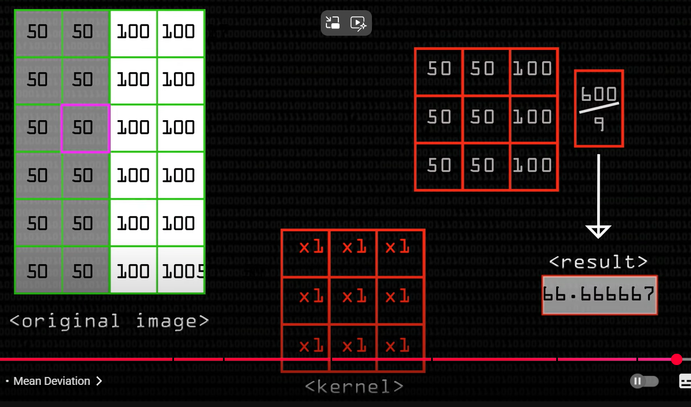
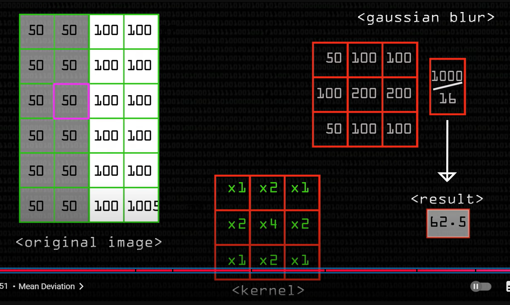

# Math Behind Blurring

Blurring in image processing often involves applying a **filter** or **kernel convolution** — a low-level operation where a grid of numbers (the kernel) is applied over an image to produce various effects like blurring or edge detection.

### Kernel Convolution

- A **kernel** (or filter) is a small matrix (e.g., 3x3, 5x5) of weights.
- This kernel is moved across the image pixel by pixel.
- At each position, the pixel values under the kernel are multiplied by the corresponding kernel weights.
- The results are summed up and used to replace the original pixel value.

This process transforms the image in controlled ways depending on the kernel values.

---

### Mean Blur (Average Blur)

- Uses a kernel where all values are **1** (or equal weights).
- This essentially computes the **average** of the surrounding pixels.
- It smooths the image by reducing sharp edges and noise.
- Example kernel for a 3x3 mean blur:

### Gaussian Blur

- Uses a kernel based on the **Gaussian distribution** (bell curve).
- Pixels closer to the center have higher weights; farther pixels have lower weights.
- This results in a smoother and more natural blur compared to the mean blur.
- It preserves edges better and reduces noise while maintaining detail.
- The weights are determined by the formula for the Gaussian function:
