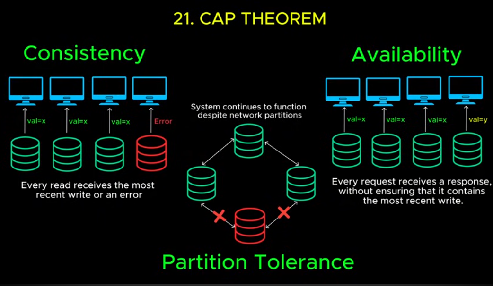

30 Concepts to know for System Design 

https://www.youtube.com/watch?v=s9Qh9fWeOAk

1. Client-Server Architecture 
- client sends requests 
- server (runs continuously) and sends back responses

2. IP Addresses 
- computers identify each other with an IP address
- every publicly owned server has a unique ip address
- clients sends a request to the IP

3. Domain Name System (DNS)
- maps a name to an IP address
- computers asks a DNS Server and returns an IP then with that IP address you can send a request

4. Proxy / Reverse proxy
- middleman between device and server
- hides your IP address

5. Latency
- delay between sending and returning data
- latency can be from physical distance

6. HTTP / HTTPS 
- a set of rules / protocol
- HTTPS encrypts all data

7. API's
- a format for how a request should be structured, what format should respon

8. REST
- most while used
- defines how clients and servers communicate
- stateless
- every request is indepenent
- everything is treated as a resource 
- uses standard HTTP methods (GET POST PUT DELETE)
- simple, scalable, easy to cache
- can be inefficient

9. GraphQL
- allows clients to get exactly what they did
- you can combine requests into one

10. Database 
- data is stored, retrieved, and securely stored here
- server is connected to the database

11. SQL Vs NoSQL 
- SQL: stored in tables with predefined schema acid properties (good for strong consistency and structured relationships)
- NoSQL: high scalability, performance, flexible schema (good for scaling)
- both databases are usually used

12. Vertical scaling 
- more CPU, Ram, Storage
- but this can't go forever and gets more expensive

13. Horizontal scaling 
- adding more servers to distribute the load

14. Load balancer 
- sits between clients and backend servers
- redirects traffic from a good server and bad server 
- uses round-robin, least connections, or ip hashing

15. Indexing 
- jumping directly to a specific section
- allows you to quickly get data

16. Replication 
- scaling a database by making copies of it 
- with a primary replica, you have multiple read replicas so they are synced 

17. Sharding
- splitting the database into smaller parts called shards
- shards have different subsets of the data 
- reduces the database load
- aka horizontal partitioning

18. Vertical partitioning 
- split database by columns
- splits tables into more specific tables

19. Caching 
- storing frequently accessed data in memory instead of fetching form a database
- requests check the cache first then checks the database
- uses ttl (time to live)

20. Denormalization 
- breaking tables into seperate tables
- reduces the number of joinds by combining related data into a single table
- allows faster queries
- good when you need fast queries
- more computationally expensive

21. Cap theorem
- Consistentcy, Availability, Partition Tolerance
- you can't have all three, you have to pick between what you want

22. Blob storage 
- Amazon S3
- individual files are stored in "buckets" with unique urls that can be easily found over the well
- advantages: scability, pay as you go, automatic replication, easy access
- but can be slow

23. Content delivery network (CDN)
- delivers content faster around the world

24. Web sockets
- continous two way connection over a single connection
- makes a handshape and do bi-directional messages
- good for real time communication

25. Web Hooks
- allows server to send an HTTP request to another server instantly

26. Microservices 
- monolithic architecture - everything in one codebase
- a codebase into smaller services
- allows servers to be scaled and deployed individually

27. Message Queues 
- allows requests to be send asyncronously

28. Rate Limiting 
- ensures bots don't send millions of requests in a certain time frame
- request quota
- instead of coding this yourself you can use an API gateway 

29. API Gateway 
- api that provides authentication, rate limiting, logging, monitoring, request routing
- routes to the appropriate microservice

30. Idempotency
- ensures duplicate requests are ignored