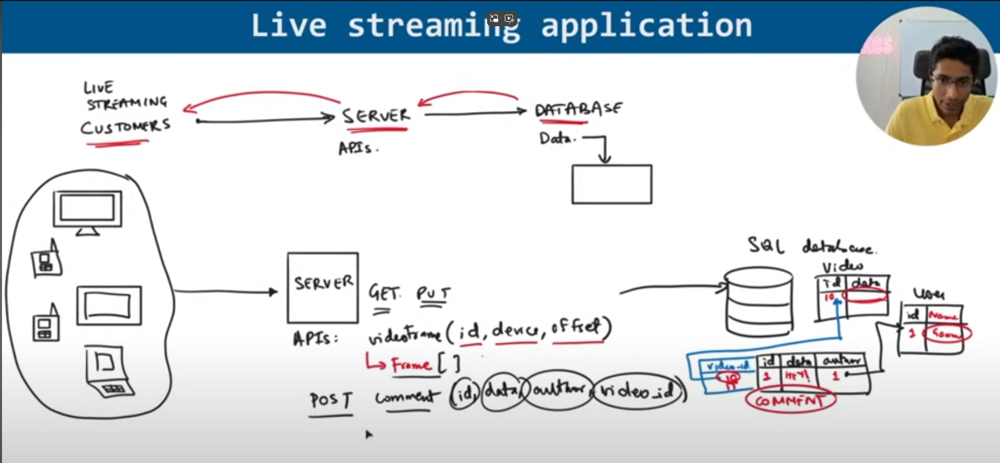
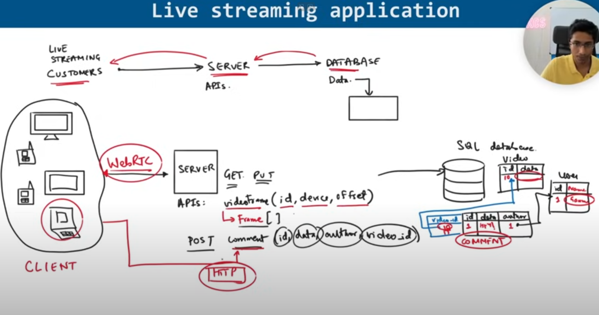
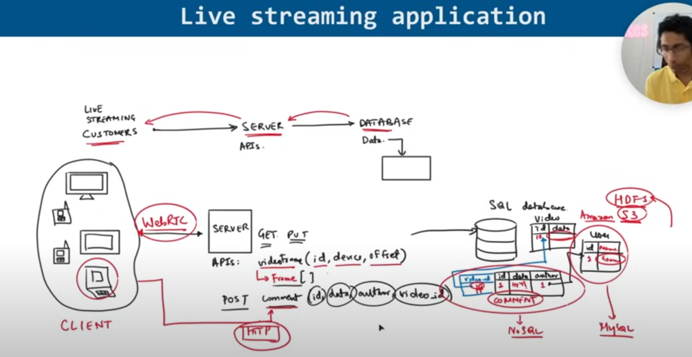

# Systems Design Course for Beginners FreeCodeCamp

https://www.youtube.com/watch?v=m8Icp_Cid5o&list=WL&index=6


Large Scale Distributed Systems 
- has a lot of data, used by alot of people, updated frequently, has performance expectations
- has many servers
- engineering teams rely on design patterns to ensure they can create these systems

Design Pattern
- General, reuseable solution to a commonly occurring problem within a given context in software design
- With these you can organize code to make reliable, scalable and maintainable solutions
- You take business requirements and convert them into technical solutions

Live Streaming System Design Example

- Product Requirement Doc -> Features / Abstract Concepts -> Data Definitions -> Objects -> DataBase

- We need to create API endpoints so that users can query and manipulate our data

Fault Tolerance

- You want to ensure none of your services fail if there is an outage

Extensibility

- solutions should be able to change / tweakable > we want a system that can scale and extend as and when requirements change

Testing

- run through different requests
- check edge cases
- load testing 

Summarizing the requirements

- Example: If we were making a live streaming platform 

- requirements would be a streaming video, processing video, broadcasting, failproof, ads, reactions, disclaimers, degredation of fail quality, cross-platform viewing

Core requirement - Streaming video

- with the main code, if you had raw 8k footage, you obviously don't want to send that much data to a phone, so instead you create a database to hold that data and allow users to query and see the correct quality
- this is a black box model that allows users to skip the api queries
- you obviously need to test these queries
- engineers need to find places where things can fail > say a firewall, bugs, feature requests, 

Diagramming the approaches


API Design


- we GET videoframes
- we POST comments

Database Design

- we want to return frames, comments and other data



- so far nothing here is concrete, just rough ideas

Network Protocols

- CLIENT SIDE: different API's require different behaviours. when watching a video, you want to have the next videoframe as soon as possible, but getting notifications for a video might be different

- SERVER SIDE: HTTP - stateless server - you have to send API requests with all the data / parameters filled - benefit is that the server is simple - if the server crashed, no memory is lost, it just forgets - servers can be added easily

- TCP Protocol: Reliable Protocol
- UDP Protocol: Real time efficient protocol



Choosing a Datastore

- Database Solutions (MySQL PostgreSQL) : defines how exactly the client interacts with the database

- HDFS or Amazon S3 are good ways to store data. It is cheap, easy to query and can store large files



Uploading Raw Video Footage

- we need to create some sort of transformation service and to convert raw data into different video formats
- 4k > 1080p, 720p, 480p, 144p
- Raw video is cut into pieces of 10 seconds, but different functions would convert it
- (Raw, 144p) -> send to client

Map Reduce for Video Transformation


WebRTC vs. MPEG DASH vs. HLS

- well how exactly does that data get sent to the clients 
- WebRTC - good for video conferences  
- MPEG DASH (Dynamic Adaptive Streaming over HTTP) - popular protocol for getting video - it handles choosing which quality to get based on the network
- HLS - protocol good for IOS and Mac

- on the server, we can have some state, like keeping the last 10 minutes in the server (saving time and bandwidth)


Content Delivery Networks

- CDN solutions are good to persist the starting data and have clients pull the data from the CDN (not really sure what this is)
- but this is good for distributed systems when performance is key

High-Level Summary


1) Defined the requirements as abstract concepts (objects)
2) Objects are maniputed and queried using API's on the server
3) the data representation need to be stored in a database
4) then you think about what type of tools and patterns to use (load balances, message queues, caches)
4) think of the interactions of the tools and how it builds together


-------------------------------------

Introduction to Low-Level Design

Goal:

- Design a scalable, memory-efficient, fault-tolerant video player system capable of handling various user actions like play, pause, seek, buffering, and streaming — while managing APIs, user behaviour, memory, and system performance.

Key Actions: 
- Play / Pause video
- Seek forward/backward
- Adjust volume / mute
- Toggle full-screen
- Select video quality
- Enable subtitles
- Buffer video (background operation)
- Load next video (autoplay / playlist)
- Download / offline mode (optional)

System Design = Consider
1) Memory Optimizations - cache video segments and decoding frames just-in-time
2) User Behaviour - preloading next segments based on seek patterns 
3) API Calling - async API calls for loading metadata, retry logic 
4) Context Switching - using coroutines / lightweight threads to manage UI + streaming + decoding
5) CI/CD Pipeline - unit tests for state transitions (play, start, stop), or integratin tests for api/bufferying
6) Concurrency / Fault Tolerance / Latency - for network failures or UI crashes

Low-Level Design Concepts

States: Idle, Playing, Paused, Buffering, Ended, Error

Modules:

1) VideoPlayerController: Handles state and user commands
2) Decoder: Decodes frames from video
3) BufferManager: Manages preloaded video data
4) Renderer: Renders frames to screen
5) NetworkManager: Fetches video segments via API

```

// Core components of the video player system

Class: VideoPlayerController
- state: PlayerState              // Current playback state
- play()
- pause()
- seek(time: float)
- stop()

Class: BufferManager
- bufferQueue: Queue<VideoSegment>   // Stores upcoming segments
- fetchSegment(startTime: float): void

Class: NetworkManager
- fetchVideoSegment(url: string): VideoSegment
- fetchSubtitles(): SubtitleData
- retryPolicy(): void

Class: Decoder
- decodeFrame(segment: VideoSegment): Frame
- reset(): void

Class: Renderer
- render(frame: Frame): void

Enum: PlayerState
- Idle
- Playing
- Paused
- Buffering
- Ended
- Error

```
```
User -> VideoPlayerController: play()
VideoPlayerController -> BufferManager: fetchSegment(currentTime)
BufferManager -> NetworkManager: fetchVideoSegment()
NetworkManager -> BufferManager: return VideoSegment
BufferManager -> Decoder: decodeFrame(segment)
Decoder -> Renderer: render(frame)
Renderer -> Screen: display(frame)
```

```
[Idle] -------- play() --------> [Buffering]
[Buffering] --- dataReady() ---> [Playing]
[Playing] ----- pause() -------> [Paused]
[Paused] ------ play() --------> [Playing]
[Playing] ----- endOfVideo() --> [Ended]
[Any State] --- errorOccurred() -> [Error]
```

Summary

A robust video player must:

1) Efficiently manage memory and system resources
2) Handle unpredictable user behavior (e.g., frequent seeks)
3) Ensure smooth playback with low latency and fault tolerance
4) Maintain clean architecture to support CI/CD and modular growth

Low-level design = clear object responsibilities, tight memory/code management, and performance-aware implementation.