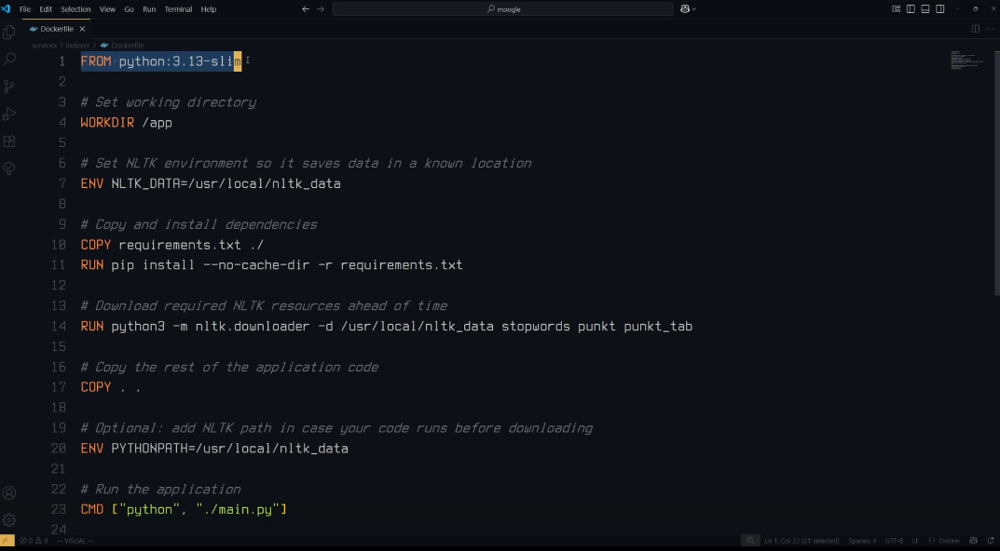

# Things I actually use Docker For

https://www.youtube.com/watch?v=pBPRr9fOLBQ&list=PLUHtiHAczBHeFsBE0cPhMzWYzo6FKHjWN&index=5

- docker image - template that contains all the configs and files to create a container
- docker file - defines how an image will be configured
- docker container - simulated machines that run a docker image

1) avoid installing things
- pull docker image
- docker run - runs the image
- allows you to install things easier
- docker image ls - list all images
- docker ps - list docker containers
- docker ps -a - list all docker containers
- docker system prine --all --volumes

2) avoid dependencies
- easier to run a docker environment rather than a virtual environment
- allows you to not have to install one million different packages




```
docker build -t indexer .
```

```
docker run --name NAME-CONTAINER NAME
```

