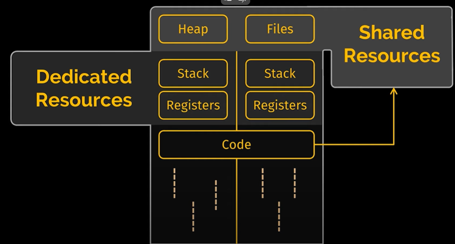

# threading

single threaded process - one thread executes all the sequence of operations
multi threaded process - joint effort of all threads will result in the execution of the sequence of operations

program - relation between a class and an object / an interface and its implementation /

what is quad core or 8-core cpus?
can run 4/8 threads in parallel (theoretically)
tasks are split into tiny time slots which make it look like its all happening in parallel
